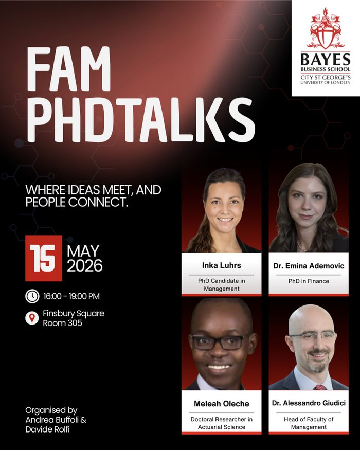
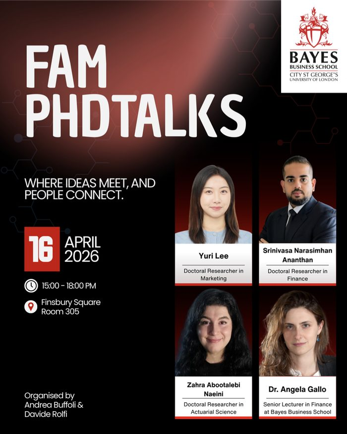
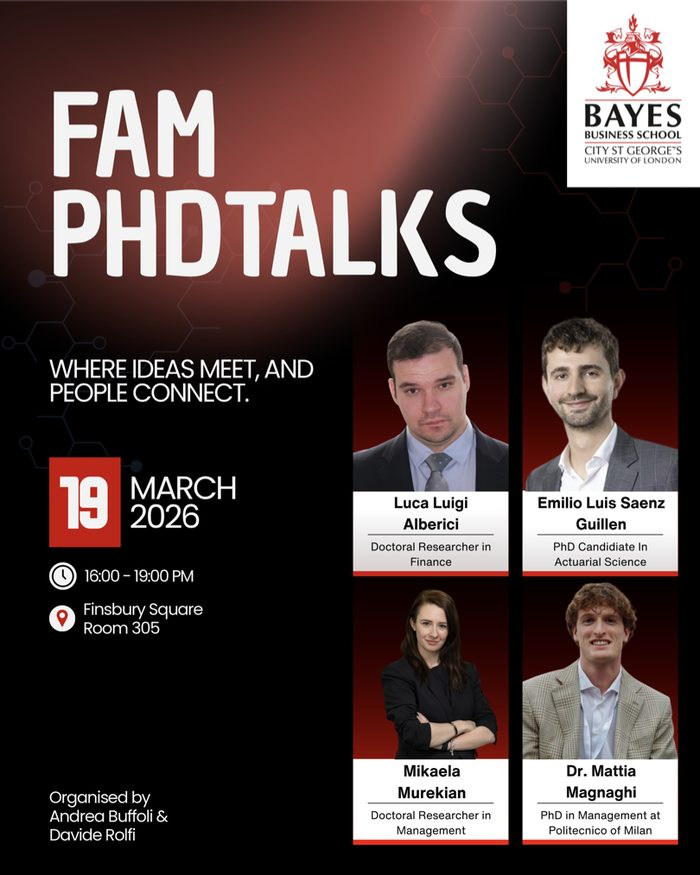
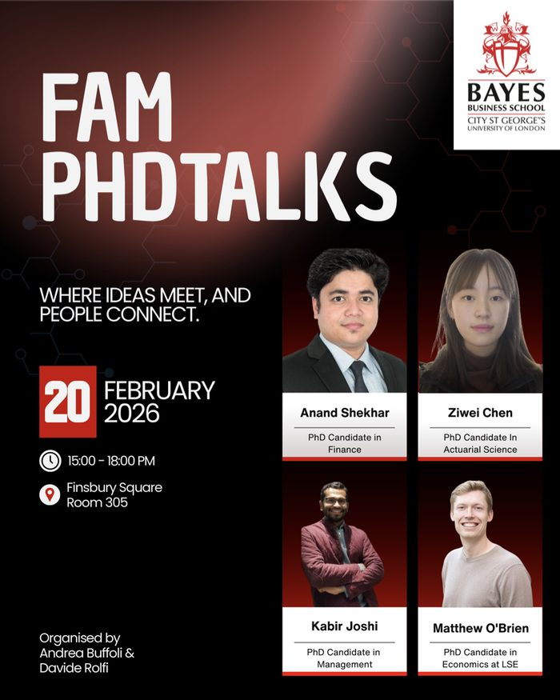
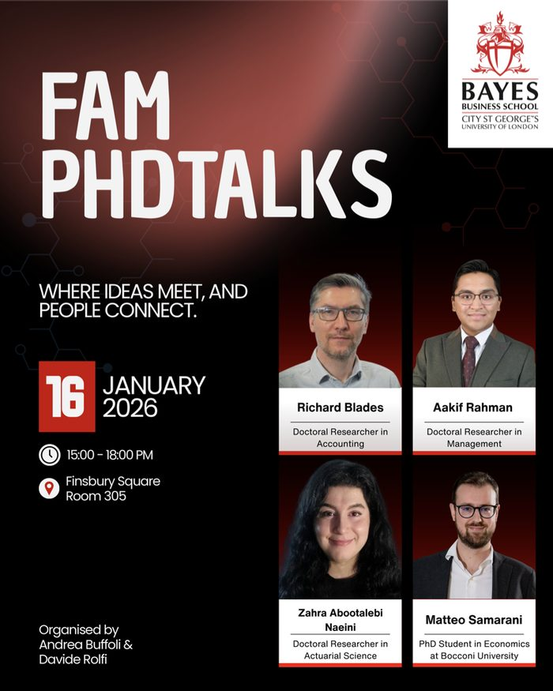
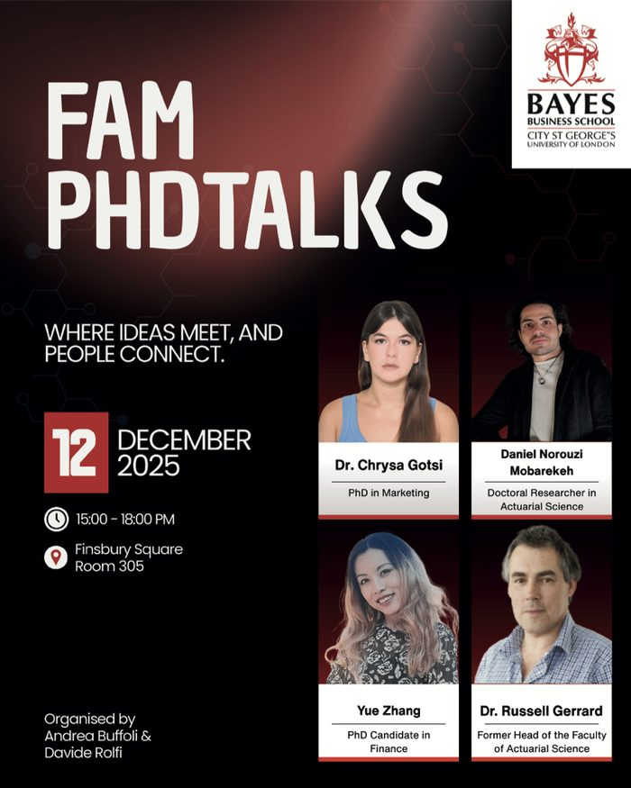
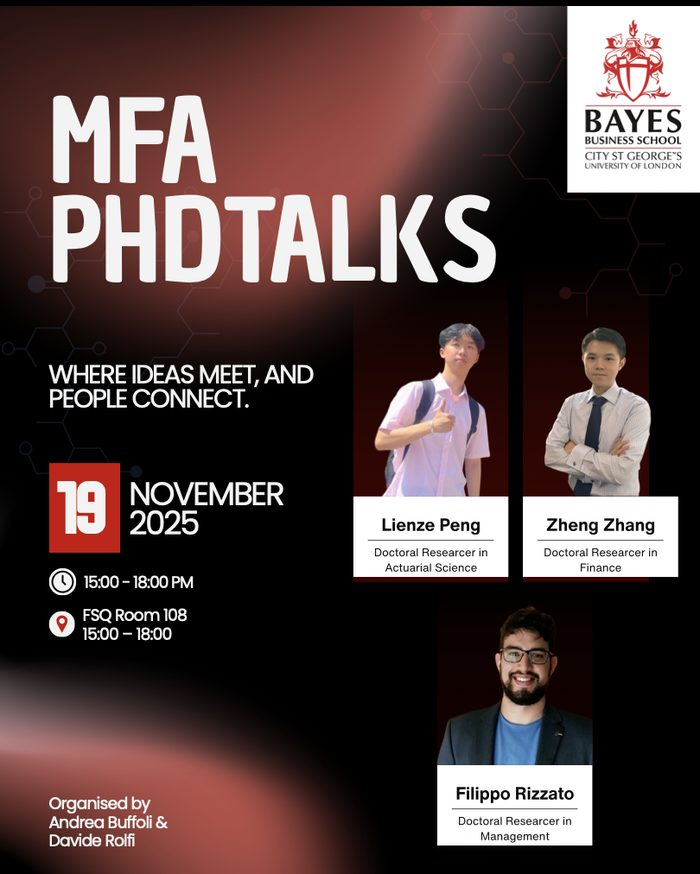

# FAM PhD Talks

FAM PhD Talks is a monthly research seminar series at Bayes Business School, co-founded to create a regular forum for doctoral students and faculty members to present research, exchange feedback, and strengthen the PhD research community.

## About the Initiative

::: {.paper-card .featured-paper}

Monthly · Bayes Business School

### Research seminars for the PhD community

FAM PhD Talks brings together PhD students and faculty members across research areas for regular research presentations and discussion. The series provides a space for doctoral researchers to present work in progress, receive feedback, and engage with methodological and conceptual questions beyond their immediate research group.

As co-founder and organiser, I help coordinate the series, including speaker planning, scheduling, event communication, and the development of a regular forum for PhD research exchange.

:::

## Event Archive

15 May 2026

<h3>May Edition</h3>

Inka Luhrs · Dr Emina Ademovic · Meleah Oleche · Dr Alessandro Giudici

16 April 2026

<h3>April Edition</h3>

Yuri Lee · Srinivasa Narasimhan Ananthan · Zahra Abootalebi Naeini · Dr Angela Gallo

19 March 2026

<h3>March Edition</h3>

Luca Luigi Alberici · Emilio Luis Saenz Guillen · Mikaela Murekian · Dr Mattia Magnaghi

20 February 2026

<h3>February Edition</h3>

Anand Shekhar · Ziwei Chen · Kabir Joshi · Matthew O'Brien

16 January 2026

<h3>January Edition</h3>

Richard Blades · Aakif Rahman · Zahra Abootalebi Naeini · Matteo Samarani

12 December 2025

<h3>December Edition</h3>

Chrysa Gotsi · Daniel Norouzi Mohassab · Yue Zhang · Dr Russell Gerrard

19 November 2025

<h3>November Edition</h3>

Lienze Peng · Zheng Zhang · Filippo Rizzato

