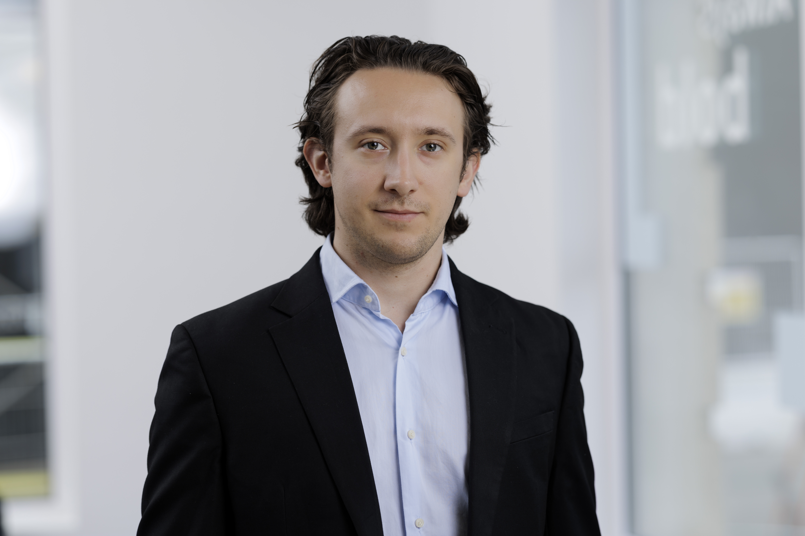

::: {.home-hero}

::: {.home-hero-grid}

::: {.home-hero-text}

PhD Candidate · Actuarial Science

# Davide Rolfi

Stochastic control, pensions, life-cycle finance, and sustainable investment

Bayes Business School · City St George's, University of London (formerly Cass Business School)

Expected PhD completion: September 2027

I use continuous-time stochastic control to study long-term financial decisions in actuarial science, pension finance, and sustainable investment. My research focuses on how individuals, pension funds, and firms respond to financial, longevity, and sustainability-related risks.

<a class="btn btn-primary" href="files/CV_Davide.pdf">Download CV</a>
<a class="btn btn-secondary" href="research.html">Research</a>
<a class="btn btn-secondary" href="contact.html">Contact</a>

:::

::: {.home-hero-portrait}

DR

:::

:::

:::

::: {.facts-grid}

::: {}

Research fields

Actuarial science, stochastic control, pension finance, life-cycle finance, sustainable investment

:::

::: {}

Current paper

<a href="research.html#current-paper">Optimal Sustainable Retirement Investing: Continuous-Time Portfolio Choice for Individual
Retirement Plans with ESG Preferences</a>

:::

::: {}

Supervisors

Professor Steven Haberman 
Dr Iqbal Owadally 
Bayes Business School

:::

::: {}

Contact

<a href="mailto:davide.rolfi@bayes.city.ac.uk">davide.rolfi@bayes.city.ac.uk</a>

:::

:::