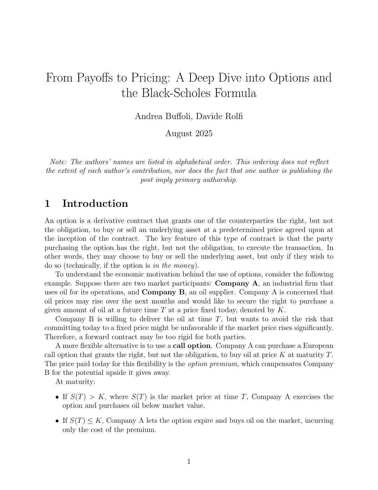
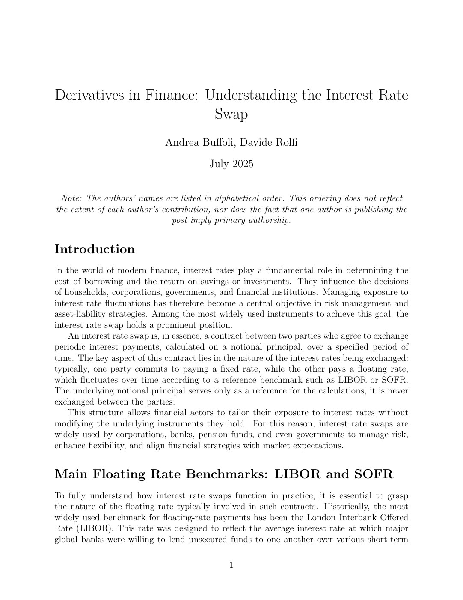
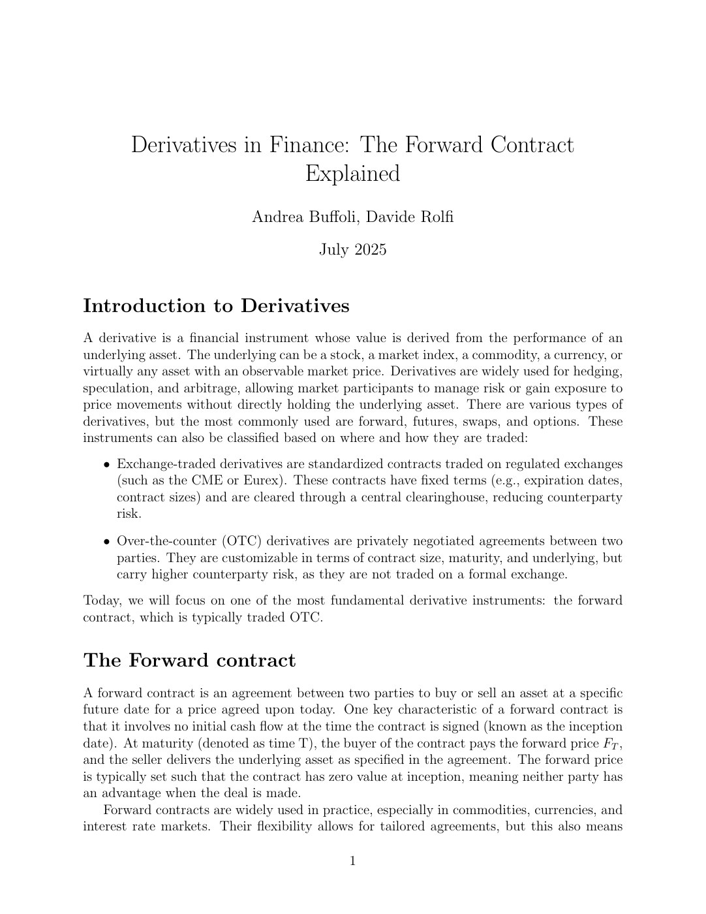
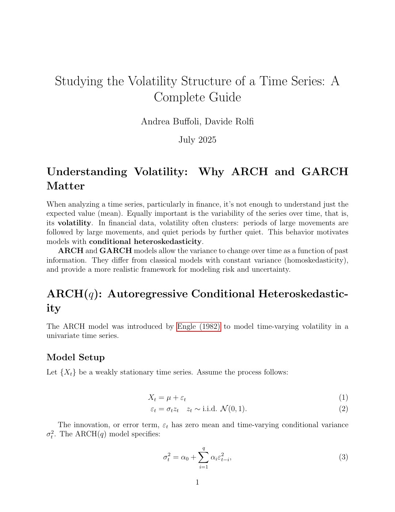
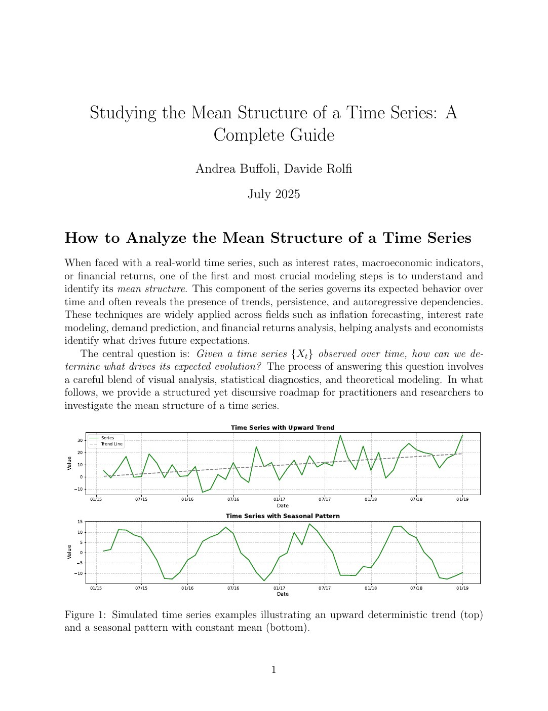
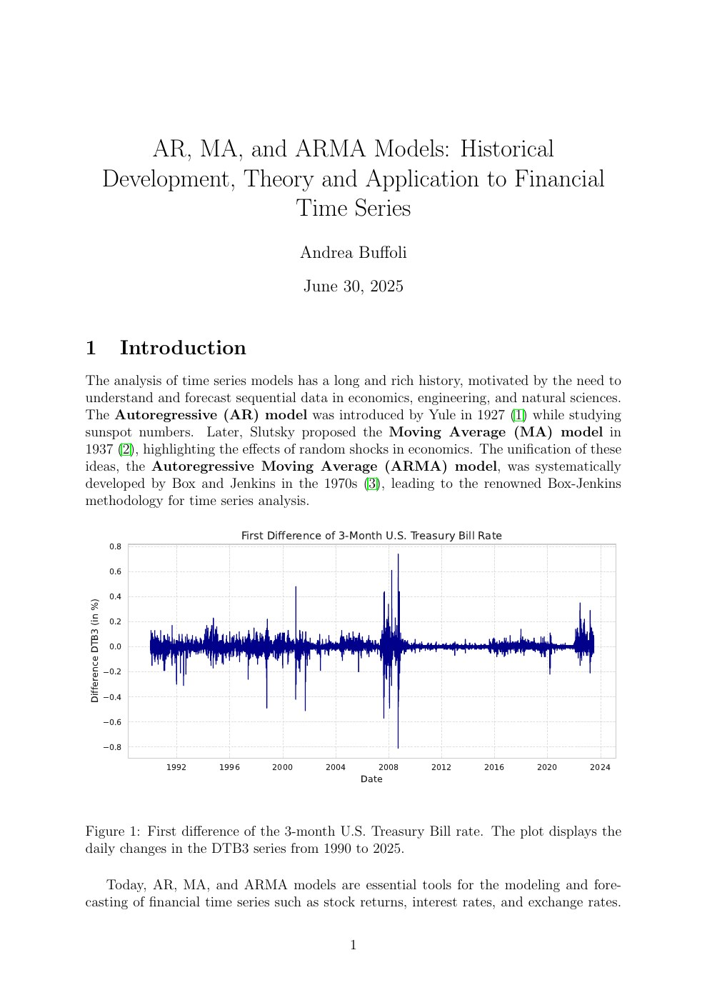
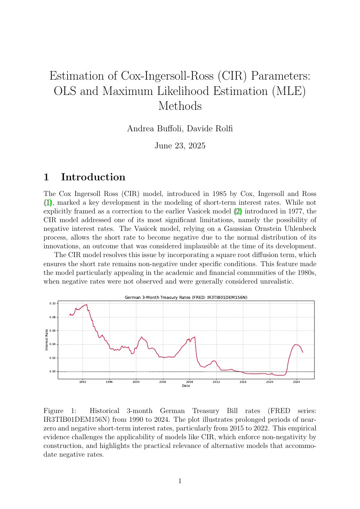
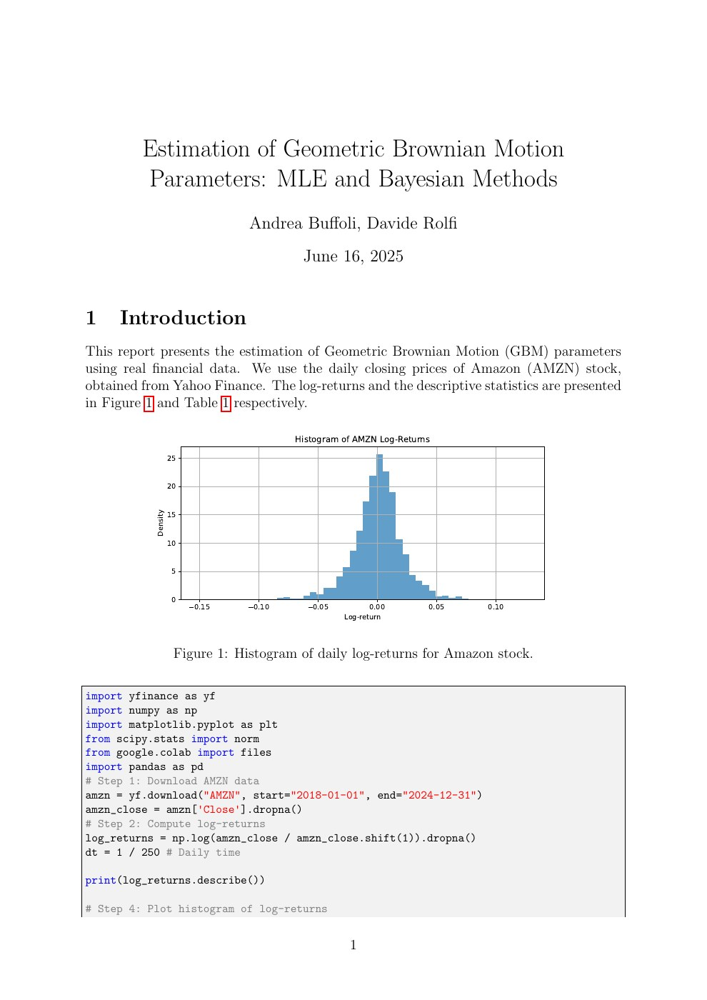
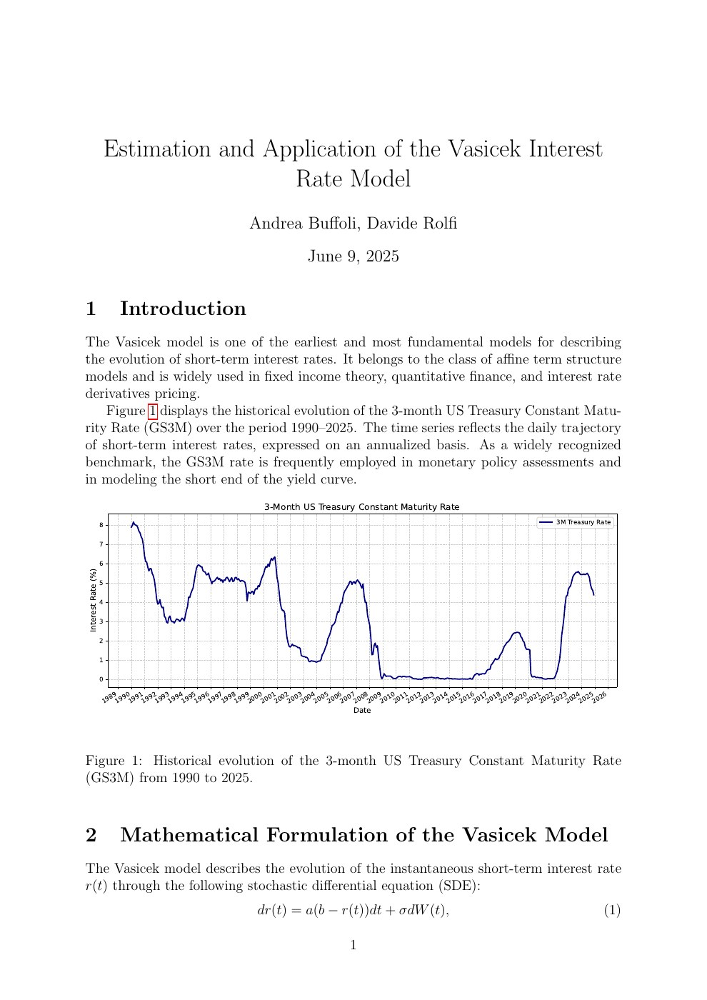

::: {.page-header}

Educational Series · Finance, Economics &amp; Statistics

# Stochastic Modelling for Finance

:::

Stochastic Modelling for Finance is a nine-part educational series explaining selected topics in finance, economics, and statistics for a broader academic and professional audience.

## About the Series

::: {.paper-card .featured-paper}

9-part series · LinkedIn

### Accessible explanations of quantitative ideas

The series was co-created by Andrea Buffoli and Davide Rolfi to make technical ideas more accessible while maintaining mathematical and financial precision.

:::

## Article Archive

Episode 09 · August 2025

<h3>From Payoffs to Pricing: A Deep Dive into Options and the Black-Scholes Formula</h3>

Andrea Buffoli · Davide Rolfi

<a href="files/stochastic-modelling-for-finance/EP9.pdf">Read article (PDF) →</a>

Episode 08 · July 2025

<h3>Derivatives in Finance: Understanding the Interest Rate Swap</h3>

Andrea Buffoli · Davide Rolfi

<a href="files/stochastic-modelling-for-finance/EP8.pdf">Read article (PDF) →</a>

Episode 07 · July 2025

<h3>Derivatives in Finance: The Forward Contract Explained</h3>

Andrea Buffoli · Davide Rolfi

<a href="files/stochastic-modelling-for-finance/EP7.pdf">Read article (PDF) →</a>

Episode 06 · July 2025

<h3>Studying the Volatility Structure of a Time Series: A Complete Guide</h3>

Andrea Buffoli · Davide Rolfi

<a href="files/stochastic-modelling-for-finance/EP6.pdf">Read article (PDF) →</a>

Episode 05 · July 2025

<h3>Studying the Mean Structure of a Time Series: A Complete Guide</h3>

Andrea Buffoli · Davide Rolfi

<a href="files/stochastic-modelling-for-finance/EP5.pdf">Read article (PDF) →</a>

Episode 04 · 30 June 2025

<h3>AR, MA, and ARMA Models: Historical Development, Theory and Application to Financial Time Series</h3>

Andrea Buffoli · Davide Rolfi

<a href="files/stochastic-modelling-for-finance/EP4.pdf">Read article (PDF) →</a>

Episode 03 · 23 June 2025

<h3>Estimation of Cox-Ingersoll-Ross (CIR) Parameters: OLS and Maximum Likelihood Estimation (MLE) Methods</h3>

Andrea Buffoli · Davide Rolfi

<a href="files/stochastic-modelling-for-finance/EP3.pdf">Read article (PDF) →</a>

Episode 02 · 16 June 2025

<h3>Estimation of Geometric Brownian Motion Parameters: MLE and Bayesian Methods</h3>

Andrea Buffoli · Davide Rolfi

<a href="files/stochastic-modelling-for-finance/EP2.pdf">Read article (PDF) →</a>

Episode 01 · 9 June 2025

<h3>Estimation and Application of the Vasicek Interest Rate Model</h3>

Andrea Buffoli · Davide Rolfi

<a href="files/stochastic-modelling-for-finance/EP1.pdf">Read article (PDF) →</a>

